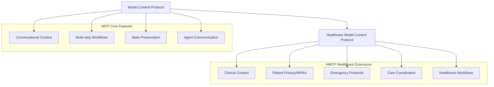

# HMCP: Healthcare Model Context Protocol

## Overview

**HMCP (Healthcare Model Context Protocol)** is our implementation of the Model Context Protocol (MCP) pattern specifically designed for healthcare environments. Like MCP enables conversational AI to maintain context across interactions, HMCP enables healthcare agents to maintain clinical context across multi-step healthcare workflows.

## Relationship to Model Context Protocol (MCP)

### MCP Foundation
The Model Context Protocol provides a standard for AI agents to:
- Maintain conversational context across interactions
- Enable multi-step problem-solving workflows
- Preserve state between agent communications
- Support iterative information gathering

### HMCP Healthcare Extension
HMCP extends these concepts for healthcare scenarios:



## Healthcare Workflow Pattern

The sequence diagram pattern shown in your screenshot demonstrates a typical HMCP workflow:

```
Physician → Diagnosis Copilot → Patient Data Agent → Medical Knowledge Agent → Scheduling Agent
```

### Step-by-Step Implementation

1. **Initial Symptom Submission**
   ```python
   # Physician provides initial symptoms
   message = HMCPMessage(
       type=HMCPMessageType.REQUEST,
       content={
           "action": "provide_initial_symptoms",
           "symptoms": ["chest pain", "shortness of breath"],
           "conversation_id": "conv_12345"
       }
   )
   ```

2. **Iterative Information Gathering**
   ```python
   # Agent requests additional patient data
   response = HMCPMessage(
       type=HMCPMessageType.REQUEST,
       content={
           "action": "request_patient_records",
           "required_identifiers": ["date_of_birth", "mrn"],
           "conversation_id": "conv_12345"
       }
   )
   ```

3. **Context-Aware Decision Making**
   ```python
   # Analysis with full clinical context
   context = ConversationContext(
       symptoms=["chest pain", "shortness of breath"],
       patient_data={"age": 45, "medical_history": ["hypertension"]},
       clinical_urgency=ClinicalUrgency.URGENT
   )
   ```

4. **Care Coordination and Scheduling**
   ```python
   # Schedule follow-up with specialist
   appointment_request = HMCPMessage(
       content={
           "action": "schedule_appointment",
           "specialty": "cardiology",
           "urgency": "high",
           "conversation_id": "conv_12345"
       }
   )
   ```

## Key Differences from Generic MCP

| Aspect | Generic MCP | HMCP (Healthcare) |
|--------|------------|-------------------|
| **Context Type** | General conversational | Clinical/Patient-specific |
| **Privacy** | Standard data protection | HIPAA compliance required |
| **Urgency** | Task priority | Clinical urgency levels |
| **Workflow Types** | General problem-solving | Clinical protocols |
| **Data Sensitivity** | Varies by domain | Always PHI (Protected Health Information) |
| **Audit Requirements** | Optional logging | Mandatory healthcare audit trails |
| **Agent Types** | General purpose | Healthcare-specialized (diagnostic, patient data, scheduling) |

## Clinical Context Preservation

HMCP maintains comprehensive clinical context throughout multi-agent workflows:

### Patient Context
```python
@dataclass
class PatientContext:
    patient_id: str
    mrn: str
    demographics: Dict[str, Any]
    insurance_info: Optional[Dict[str, Any]] = None
    emergency_contacts: List[Dict[str, Any]] = field(default_factory=list)
```

### Clinical Context
```python
@dataclass
class ClinicalContext:
    chief_complaint: str
    urgency: ClinicalUrgency
    specialties_required: List[str] = field(default_factory=list)
    care_team: List[str] = field(default_factory=list)
    facility: Optional[str] = None
```

### Conversation Context
```python
class ConversationContext:
    def __init__(self, conversation_id: str, patient_id: str):
        # Healthcare-specific context
        self.symptoms: List[str] = []
        self.clinical_data: Dict[str, Any] = {}
        self.medications: List[Dict[str, Any]] = []
        self.care_plan: Dict[str, Any] = {}
        
        # Workflow tracking
        self.information_needed: List[str] = []
        self.recommendations: List[Dict[str, Any]] = []
        self.participating_agents: Set[str] = set()
```

## Healthcare-Specific Features

### 1. Emergency Response Protocols
```python
class EmergencyProtocol:
    def handle_cardiac_emergency(self, context: ConversationContext):
        # Immediate care team activation
        # Real-time vital monitoring
        # Automated medication recommendations
```

### 2. HIPAA Compliance
```python
class HIPAACompliantMessage(HMCPMessage):
    def __init__(self, *args, **kwargs):
        super().__init__(*args, **kwargs)
        self.phi_flag = True
        self.audit_trail = []
        self.encryption_level = "AES-256"
```

### 3. Clinical Decision Support
```python
async def clinical_decision_workflow(self, symptoms, patient_data):
    # Multi-step clinical reasoning
    # Evidence-based recommendations
    # Drug interaction checking
    # Treatment protocol suggestions
```

## Implementation Examples

### Basic Healthcare Workflow
```python
# Initialize HMCP agents
diagnosis_agent = EnhancedHMCPAgent("diagnosis", {"agent_type": "diagnostic"})
patient_agent = EnhancedHMCPAgent("patient_data", {"agent_type": "patient_data"})
knowledge_agent = EnhancedHMCPAgent("medical_knowledge", {"agent_type": "medical_knowledge"})

# Execute multi-step healthcare workflow
async def healthcare_workflow():
    # Step 1: Symptom analysis
    symptom_response = await diagnosis_agent.process_hmcp_message(symptom_message)
    
    # Step 2: Patient data retrieval
    patient_response = await patient_agent.process_hmcp_message(patient_request)
    
    # Step 3: Medical knowledge consultation
    knowledge_response = await knowledge_agent.process_hmcp_message(knowledge_request)
    
    # Context is preserved throughout the entire workflow
```

### Advanced Clinical Integration
```python
# Integration with FHIR systems
fhir_integration = FHIRIntegration()
conversation_context = ConversationContext("conv_123", "patient_456")

# Workflow with real clinical systems
async def integrated_workflow():
    # Retrieve from FHIR server
    patient_data = await fhir_integration.get_patient("patient_456")
    
    # Process through HMCP workflow
    result = await hmcp_workflow(patient_data, conversation_context)
    
    # Update FHIR records with results
    await fhir_integration.update_patient_record(result)
```

## Benefits of HMCP over Generic MCP

1. **Healthcare-Optimized**: Purpose-built for clinical workflows
2. **Compliance-Ready**: Built-in HIPAA and healthcare regulation support
3. **Emergency-Aware**: Handles clinical urgency and emergency protocols
4. **Multi-disciplinary**: Supports complex care team coordination
5. **Evidence-Based**: Integrates with medical knowledge systems
6. **Audit-Complete**: Comprehensive healthcare audit trail requirements

## Getting Started

See the complete workflow demonstration in:
- `examples/healthcare_mcp_workflow_demo.py` - Full workflow example
- `vita_agents/agents/enhanced_hmcp_agent.py` - Enhanced HMCP implementation
- `vita_agents/protocols/hmcp.py` - Core HMCP protocol definitions

HMCP brings the power of Model Context Protocol to healthcare, enabling sophisticated multi-agent healthcare AI systems that maintain clinical context, ensure patient privacy, and support complex healthcare workflows.